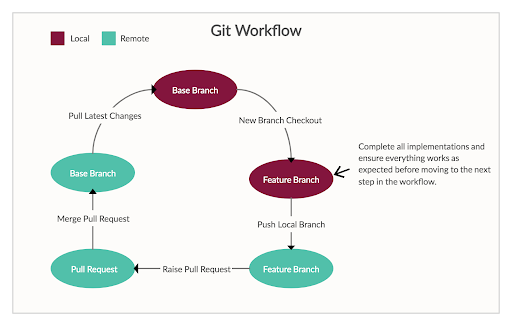

# SQL Model

We want to write simple model classes for interaction with database tables using raw SQL. This will serve as a simple Object Relational Mapper (ORM) that can be injected into a larger project.

## Prerequisites

1. The pdf document at https://www.hcoe.edu.np/uploads/attachments/r96oytechsacgzi4.pdf gives explanations and examples of how to use different SQL commands and write different SQL queries.

The document has many sections and talks about a lot of things, but let your focus be on what you want to do or achieve and know how to do it well as you move on.

2. Before you start writing SQL queries, you would need to install a database engine first. For this exercise, we will be using the PostgreSQL database engine. You need to have it installed on your machine and after the installation, you get access to a simple client command line tool called `psql` you can use to communicate with the database from the terminal.

After installation, type the command below to use `psql` to get the version of the Postgresql database engine you have installed.

```bash
  $ psql --version
```

3. Now that you have your database installed and running, we need a driver, that our models will use to communicate with the database server/engine. There are different python driver modules you can use in your application, for this exercise, we will be using the psycopg2 driver. The article at https://pynative.com/python-postgresql-tutorial/ and documentation at http://initd.org/psycopg/docs/usage.html shows an example of how to use it to communicate with the engine.

The focus there is on the API methods provided to you by the driver in making the communication.

## Objective 

We want to learn how to write SQL database queries for performing database operations. At the end of this task, we should be able to

- Write SQL queries to create, update, fetch and delete records in the database.
- Understanding the concept of Git workflow using branches and pull requests.
- The concept of TDD, where we write tests first.

### Part I → PostgreSQL

We will be dealing with two database tables namely, `users` and `songs`. Where users can have many songs in the database. Hence there is a one to many relationships between users and songs, that is, a user can have many songs and a song can only belong to one user.

Users table fields will include: `id`, `username`, `first_name`, `last_name`, `created_at` and `updated_at`

Songs table fields will include: `id`, `user_id`, `name`, `genre`, `created_at` and `updated_at`

The following database concepts you need to understand include:

- Connect to PostgreSQL database server.
- Create database and database tables.
- Relationships between database tables using primary and foreign keys.
- Fetching records using SELECT, JOIN, WHERE SQL statements.

### Expectations

At the end of this exercise, we will have the following

1. A **schema file**, an SQL script that when run should create our database tables Users and Songs that we will be working with.
2. A **seeder file**, which is a script that adds default data into these tables so we have default data we can play with first.
3. A **models** folder that holds all models files, that is user.py and song.py. These files will hold the definition of our model classes for communication with their respective database tables.
4. A **test folder** that will contain our written tests for the model classes.

### Setup

Follow these steps to get set up before starting to define model methods

- Clone the repository from the Github classroom.
- Create and checkout to a new git branch called setup. And in this branch ...
- Create two files named `schema.sql` and `seeder.sql`
- Create the folders namely; `models` and `tests`
- In the model’s folder, create two files with the name `user.py` and `song.py`, and within each file, define empty classes with the name `User` and `Song` respectively.
- In the tests folder, create two test files `test_user.py` and `test_song.py`, and within each file, create empty test case classes `TestUser` and `TestUser` respectively.
- Make a commit for your changes in the setup branch and push the branch to your remote repository.
- Visit the repository on Github and create a pull request from the branch setup into master/main.
- Now merge the pull requests.
- Go back to GIT and checkout to master, and pull the merged changes into your local master.
- So you can now start that cycle again for subsequent implementation

### Features to implement

Below is a list of actions we want to be able to perform using these models, and each one below should follow the workflow. This means that you should have at least 8 pull requests at the end of this exercise, which each pull request containing implementation for a model method and the test for it in the TDD order.

1. Fetch all users available: User.all()
2. Fetch one user by id : User.get(<int: id>)
3. Create a user record : User.create(params)
4. Update a user record: User.update(id, params)
5. Delete a user record: User.destroy(id) - CASCADE
6. Fetch all songs available for a user: Song.all(user_id)
7. Fetch one song by id : Song.get(<int: id>)
8. Create a song record : Song.create(user_id, params)
9. Update a song record: Song.update(id, params)
10. Delete a song record: Song.destroy(id)

### Part II → SQLite

In this part, we want to manage data presented in CSV format in the `grades.csv`, which contains data about student grades in different tests they have written. Check it out to understand the type of data you will be working with.

### Features to implement

1. Transfer data in CSV file into an SQLite database.
2. Performs CRUD operation on the transferred data.
3. Fetch student that passed (has a final grade of 50 and above).
4. Fetch students that failed (has a final grade less than 50).
5. Fetch students that scored 45 and above in `test1`.

**Note:**
You will be dealing with an SQLite database here and interacting with it using the `sqlite3` module.
Data will be read/written to an SQLite database named `gradedb.sqlite`.
The git workflow and TDD approach also apply in this section.

### Git Workflow & TDD

The GIT workflow we will be following here has been briefly explained in the steps above, but to reiterate, the is illustrated below

Local Master -> Local New Branch -> Remote New Branch -> Pull Request -> Remote Master -> Local Master

Now, apart from the Git workflow, we are also following the TDD concept. To explain this, it simply means that we write our test first, run and see it fail, implement the feature to make it pass, now run your test and see it pass.

Write Test -> Run Test and Fail -> Implement Feature -> Run Test and Pass



### Git Branch Naming Convention

Naming your branch well is important to help you differentiate the different branches you might have on your repositories be it local or remote.

The format we will be using is:  `<type>-<short desc separated by hyphen>`. The types of branches you can have varies depending on its purpose. So type can be

- Feature: e.g  feature-implement-login or ft-implement-login 
- Bugfix: e.g  bug-refactor-login-class or bg-refactor-login-class
- Chore: e.g  chore-setup-devenv or ch-setup-devenv


## Happing Hacking... 🎉🎉✨✨🎇